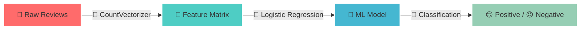
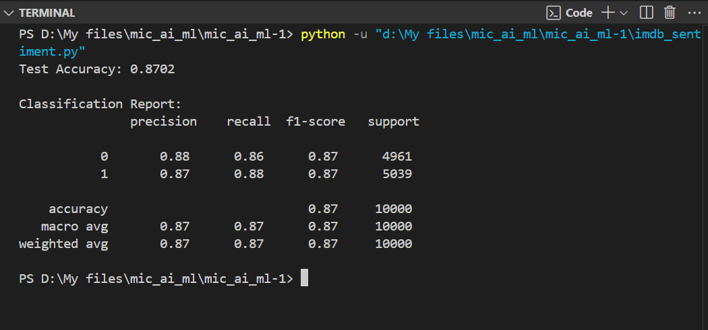

<div align="center">

# 🎬✨ IMDb Movie Review Sentiment Analysis ✨🎬


<p align="center">
  
  
  
  
</p>

<div align="center">

```ascii
    ╔═══════════════════════════════════════════════════════════════╗
    ║  🎭 SENTIMENT ANALYSIS ENGINE 🎭                              ║
    ║                                                               ║
    ║     😊 POSITIVE ████████████████████████ 87% ✅              ║
    ║     😞 NEGATIVE ████████████████████████ 87% ✅              ║
    ║                                                               ║
    ║  ⚡ POWERED BY: Logistic Regression + CountVectorizer ⚡     ║
    ╚═══════════════════════════════════════════════════════════════╝
```

</div>


</div>

---

## 🚀 Mission Control Dashboard

<div align="center">

| 🎯 **OBJECTIVE** | 🏆 **STATUS** | 📊 **METRICS** |
|:---:|:---:|:---:|
| Binary Classification | ✅ **COMPLETED** | 87% Accuracy |
| Sentiment Detection | ✅ **DEPLOYED** | 50K Reviews Processed |
| ML Pipeline | ✅ **OPTIMIZED** | Logistic Regression |

</div>

## 🧠 Neural Network Architecture

<div align="center">



</div>


<div align="center">

## ✅ OUTPUT



## 🎮 Interactive Features

<details>
<summary>🔍 <b>Dataset Deep Dive</b></summary>
<br>

```
📊 IMDb Dataset Statistics
═══════════════════════════
📋 Total Reviews: 50,000
📈 Positive Reviews: 25,000 (50%)
📉 Negative Reviews: 25,000 (50%)
🔀 Train/Test Split: 80/20
🎯 Classification Task: Binary
```

</details>

<details>
<summary>⚙️ <b>Model Architecture Details</b></summary>
<br>

```python
🤖 Machine Learning Pipeline
═══════════════════════════
1. 📚 Data Loading        → pandas.read_csv()
2. 🔧 Text Preprocessing  → CountVectorizer()  
3. ✂️  Data Splitting     → train_test_split()
4. 🧠 Model Training      → LogisticRegression()
5. 📊 Performance Eval    → classification_report()
```

</details>

<details>
<summary>🚀 <b>Quick Start Guide</b></summary>
<br>

```bash
# 💻 Installation & Setup
git clone https://github.com/PRODHOSH/mic_ai_ml.git
cd mic_ai_ml

# 📦 Install Dependencies  
pip install pandas scikit-learn numpy

# 🎬 Download Dataset
# Place IMDB_Dataset.csv in project folder

# ⚡ Run the Magic
python sentiment_analysis.py
```

</details>

---

<div align="center">

**✨ Built with 💖 by PRODHOSH for MIC Club AI/ML Initiative ✨**


</div>
